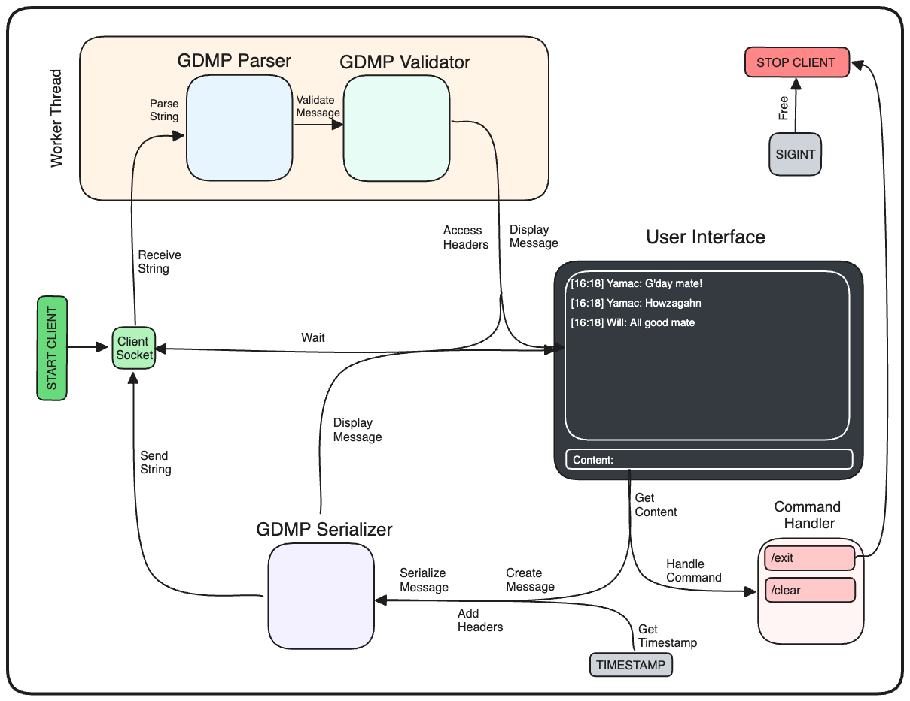

**Gdaymate** is a simple CLI-based client-server messaging app

---

### Server Logic

1. Create a TCP server
	- Create a socket
	- Create a poll set
	- Create a [[Concurrency#Thread Pools | thread pool]]
	- Setup the server
		- Define the server [[Networks#Socket Adresses | socket address]]
		- Bind server socket to server socket address
		- Add server socket to poll set
2. Start the server
	- Start listening for incoming connections
	- Start server loop
3. Stop the server (on SIGINT)
	- Set the shutdown flag to true
	
##### Server loop

1. Wait until at least one socket is ready or timeout runs out
2. Check all sockets in poll set
	- If the socket is the server
		- Accept a connection (get a client)
		- Add client into the poll set
	- If the socket is a client
		- Remove client from the poll set
		- Create a task to receive the message
		- Add task to the task queue (of the thread pool)
3. End loop if the shutdown flag is true
	- Free thread pool
	- Close all sockets
	- Free the poll set
		
##### Receive Message

1. Receive the string
2. Parse the string
3. Validate the message
4. Process the message
5. Add client back into the poll set

##### Process Message

- Process Text Message
	1. Access the headers
	2. Log the message
	3. Broadcast to other clients
		- Create a task to send the text message (for each client)
			- Serialize the message
			- Send the string
		- Add task to the task queue (of the thread pool)
- Process Join Message (TODO)

##### Diagram


---

### Client Logic

1. Create a TCP client
	- Create a socket
	- Create a user interface
	- Setup the client
		- Define server socket address
		- Connect client socket to server socket address
2. Start the client
	- Start the receive messages loop (on a seperate thread)
	- Get the username
	- Start client loop
3. Stop the client (on SIGINT)
	- Close the socket
	- Wait for receive message thread to join
	- Free the user interface

##### Receive Messages Loop

1. Receive the string
2. Parse the string
3. Validate the message
4. Access the headers
5. Display the message

##### Client Loop

1. Get the content
2. Handle if command
3. Get the timestamp
4. Send the text message

##### Send Message

- Send Text Message
	1. Create a message
	2. Add headers to the message
	3. Serialize the message
	4. Send the string
	5. Display the message
- Send Join Message (TODO)

##### Custom Commands

- `/exit`: Stop the client
- `/clear`: Clear messages

##### Diagram



---

### Custom Protocol

**Gdaymate Protocol (GDMP)** is a custom network protocol that operates at the *application layer* of the OSI model defining the structure of messages in Gdaymate

##### GDMP Messages

**GDMP messages** begin with the message type followed by the message data

```
GDMP_TEXT_MESSAGE
Username: Will
Content: G'day mate!
Timestamp: 14:18
```

##### GDMP Message Types

**GDMP message types** each have certain headers that they expect, if an expected header isn't found then the message is invalid, additional headers are ignored

1. GDMP_TEXT_MESSAGE
2. GDMP_JOIN_MESSAGE

##### GDMP Message Data

**GDMP message data** is given in header-value pairs which are *case-sensitive* and *unordered*

- Username
- Content
- Timestamp

---

### Client User Interface

Client user interface is built using the `ncurses` library

- Display Message
	1. Scroll messages (if overflows)
	2. Add message to messages
	3. Print messages
- Display Input
	1. Print prompt
	2. Capture input

---

### Future Ideas

- Rooms
- Authentication
- Data Persistance
- Data Analysis
- Message Encryption
- Multimedia Transmission
